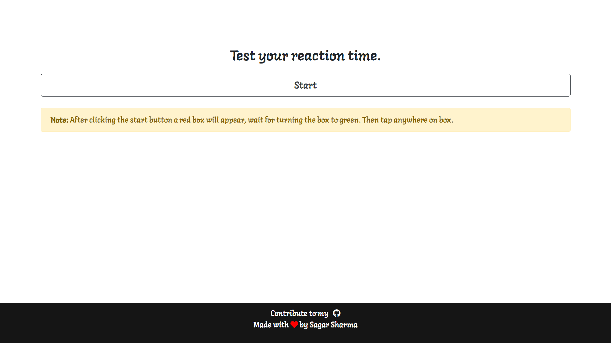
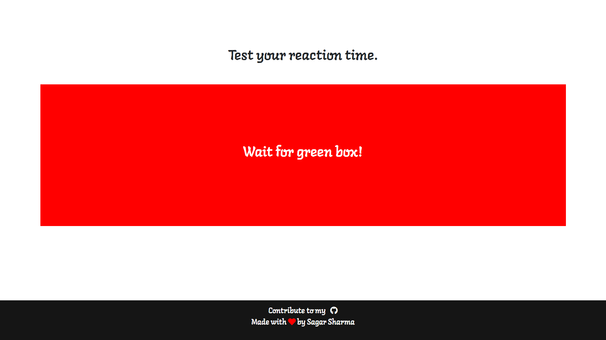
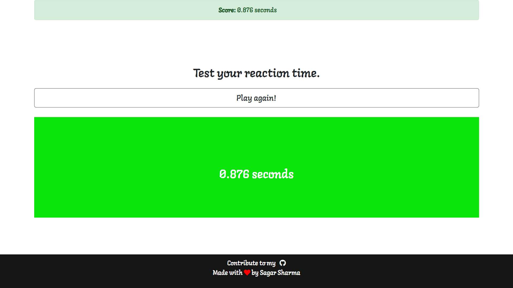

## Hi, I'm Sagar Sharma
## A Simple Reaction Game
<br>

## [View Demo](https://sagar-sharma-7.github.io/Reaction-Game/public/index.html)

If you have any crazy idea then please pull request...

## Result
<p align="center">
  
  <br>
  
  <br>
  
</p>

<br>


## Text Editor Used


## Languages Used
<p float="left">

 
 
 
 
 
 
 


</p>
<hr>

### The Reaction Game is Running on local host using expressjs.

### How to get express?
1. First make a package.json file using npm command **`$ npm init`**
2. Then type second command to get express **`$ npm i express`**
3. Now you can check your dependences on **package.json**

 <hr>

 ## How to get Bootstrap
 ```html
<link rel="stylesheet" href="https://stackpath.bootstrapcdn.com/bootstrap/4.3.1/css/bootstrap.min.css" integrity="sha384-ggOyR0iXCbMQv3Xipma34MD+dH/1fQ784/j6cY/iJTQUOhcWr7x9JvoRxT2MZw1T" crossorigin="anonymous"> 
```

## How to get jQuery
```html
<script src="https://ajax.googleapis.com/ajax/libs/jquery/3.5.1/jquery.min.js"></script>
```


## How to make Node.js server with Express
```js
const express = require("express");
const app = express();
const path = require("path");
const port = 8000;

const filePath = path.join(__dirname, "../public");
app.use(express.static(filePath));

app.listen(port, () => {
    console.log("Server is live now!!!");
});
```

 ## Cloning this repositary using command line
 1. Open **Git Bash**.
 1. Change the current working directory to the location where you want the cloned directory.
 1. Type `git clone https://github.com/Sagar-Sharma-7/Reaction-Game.git`
 1. Press **Enter** to create the clone of this repositary.
 `


 ## How to reach me?
 [ ](mailto:6969sagarsharma@gmail.com)
 <hr>
 <br>

[](https://github.com/Sagar-Sharma-7)
 <hr>
 <p float="left">

[](https://github.com/Sagar-Sharma-7)
[ ](https://github.com/Sagar-Sharma-7)

</p>


[](https://github.com/Sagar-Sharma-7)


